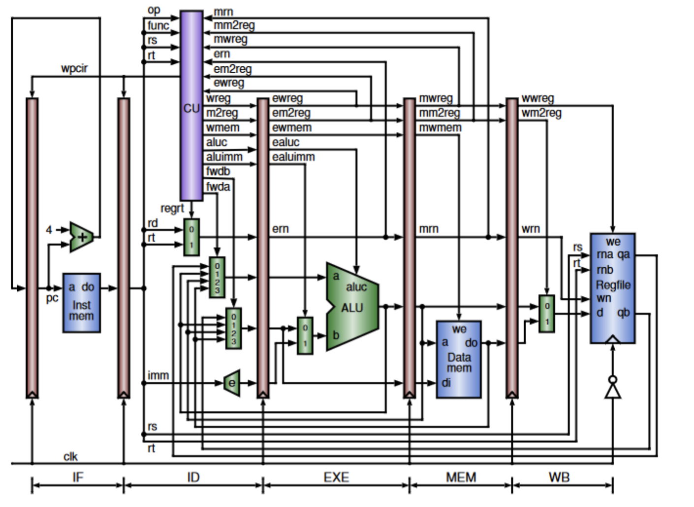

# CPU Design for Basic Arithmetic and Logical Operations

- **Summary**: This project, part of CMPEN331 at Penn State University, involved implementing a 32-bit operating pipelined CPU with forwarding. The CPU design was optimized to execute basic arithmetic and logical operations including ADDITION, SUBTRACTION, OR, AND, and XOR.

- **Tools Used**: The CPU was designed using Verilog, a hardware description language used for electronic system design. The implementation focused on efficient pipelining and included forwarding for enhanced performance.

## File Descriptions

1. **`Alu.v`**: The Arithmetic Logic Unit (ALU) Verilog file, responsible for performing the arithmetic and logical operations.

2. **`AluMux.v`**: A multiplexer Verilog file associated with the ALU for selecting operands.

3. **`ControlUnit.v`**: The Verilog file for the Control Unit, which interprets instructions and generates control signals for the CPU operations.

4. **`DataMemory.v`**: This file contains the implementation of the data memory module in Verilog.

5. **`DataPath.v`**: The Data Path Verilog file, integrating various components like ALU, registers, and control unit for data processing.

6. **`EXEMEMPipelineRegister.v`**: A Verilog file for the execution-memory pipeline register, part of the CPU's pipelining mechanism.

7. **`ForwardingMultiplexerA.v`** and **`ForwardingMultiplexerB.v`**: Implement the forwarding multiplexers, crucial for handling data hazards in the pipeline.

8. **`IDEXEPipelineRegister.v`**: Implements the ID/EXE pipeline register, holding instruction and data between the Instruction Decode and Execution stages.

9. **`IFIDPipelineRegister.v`**: The IF/ID pipeline register file, storing data between the Instruction Fetch and Instruction Decode stages.

10. **`ImmediateExtender.v`**: A module for extending immediate values used in instructions.

11. **`InstructionMemory.v`**: Contains the implementation of instruction memory, storing the instructions to be executed.

12. **`MEMWBPipelineRegister.v`**: The MEM/WB pipeline register, used in the final stages of the pipeline.

13. **`PcAdder.v
